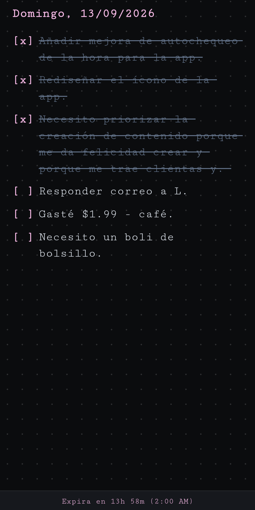

## 📓 Ephemeral BuJo Page

`A minimalist, ephemeral daily log for rapid capturing & intentional reflection.`

---

## 🩷 Why I created this app

I built this app to complement my physical bullet journal notebook.

I needed a quick, distraction-free digital space to capture tasks and notes on the go throughout the day if I don't have my physical notebook on hand.

Everything automatically resets at 2:00 AM—this intentional "expiration date" forces you to reflect each evening and migrate only the relevant notes into your physical notebook before the digital page goes blank for a fresh start tomorrow.

## ⚡ How It Works

- **No Digital Clutter:** Automatically resets at 2:00 AM, keeping the space clean and preventing the accumulation of obsolete notes.
- **Local Storage:** All entries are stored locally on the device via `localStorage` without cloud tracking or external databases.
- **Cross-Platform Access:** Works via browser or installable as a web app (PWA) on mobile and desktop.
- **Minimal Interface:** Dark mode, dot-grid layout, monospace font, and `#f4b8e4` pink accents.

## 📝 Live App

[Launch Ephemeral BuJo Page ➔](https://ollivaw.github.io/Bujo/)
